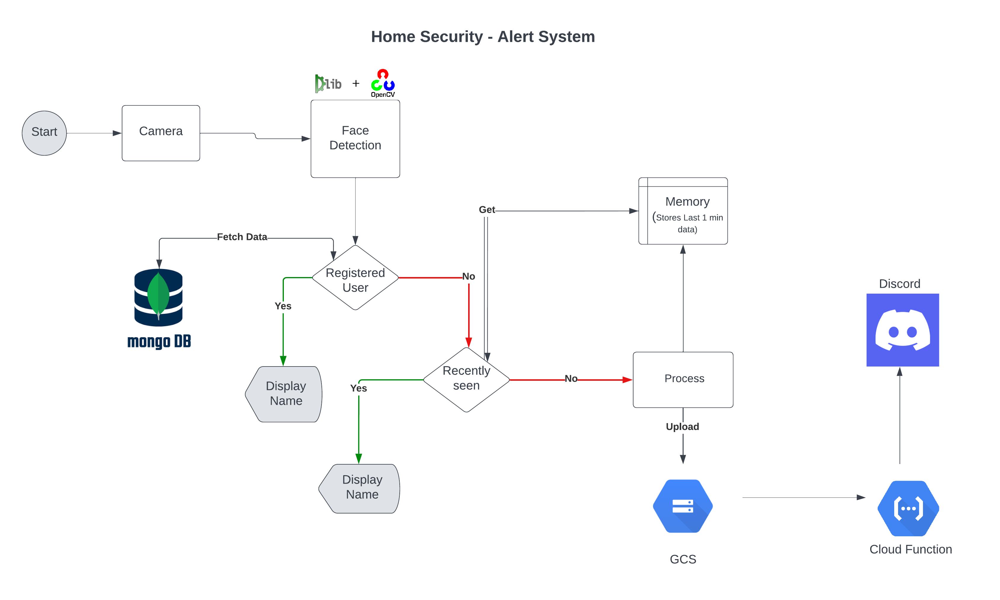

# Title: Home Security - Alert System

This project is to alert home owners/registered users when an unknown person enters into the home territory. It is implemented using computer vision and deep learning technologies on a RPi3 board with a camera module.

## Approach:
The system reads camera feed continously and analyzes every alternate frame. If any faces are detected in the frame, then it compares them against the registered user data (stored in MongoDB). If the faces are new, then it uploads the image to GCS. The GCS has a put trigger that invokes a cloud function that sends an automatic message to a Discord channel.

## System Overview:

